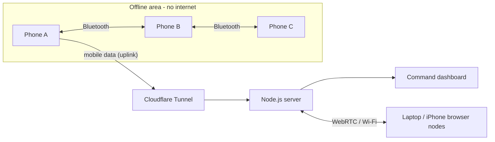

# Relay-Mesh: Off-Grid Mesh Messaging for Disaster Response

> When the network falls, every phone becomes the network.

**Repository:** https://github.com/melvinakshay18-love/relay-mesh

Relay-Mesh is a peer-to-peer mesh messenger. Phones talk to each other directly over **Bluetooth**, with **no internet, no SIM and no cell towers**. Messages hop from phone to phone until they reach the person they're for. They stay **end-to-end encrypted** on the way. If nobody is in range, the phones hold on to them and deliver them later (store-and-forward). When **any one phone** finds internet, the whole offline mesh, including SOS locations, shows up on a live web dashboard for rescue coordinators.

---

## Demo

### Android phones: Bluetooth mesh with no internet

https://github.com/user-attachments/assets/2f66011c-6aa9-4630-aac7-82aaab039bdb

### Website: command dashboard and browser nodes

https://github.com/user-attachments/assets/9318ba8a-f6df-42e4-94fd-c91e073f3e6d

---

## 1. What is this project about and why did we build it?

### The problem
In floods, earthquakes, cyclones and landslides, the **communication network is usually the first thing to fail**. Towers lose power or get damaged, and the networks that survive become overloaded. People who are stranded can't call for help, and rescue teams can't tell who needs help or where.

Most messaging apps (WhatsApp, Telegram, SMS) **depend on the internet or the cellular network**. When those go down, the apps stop working, even though everyone's phone is still on and the people who need each other may be only a few hundred metres apart.

### Our idea
Every smartphone already has a radio that works without any network: **Bluetooth**. If every phone can **receive, store and pass on** messages for others, a crowd of phones becomes its own network, a **mesh**:

- No towers, no internet, no central server needed.
- The more people join, the further the network reaches.
- Messages to someone out of range are **carried** until a path to them appears.
- As soon as **one** phone gets a connection, it becomes the bridge that brings the whole area online for rescuers.

### Goals
1. Send messages and SOS alerts with **zero infrastructure**.
2. Keep messages **private**: phones that relay a message can't read it.
3. **Never lose a message**: deliver it later if it can't go now.
4. Give rescue coordinators a **live picture** of the offline area (who is there, how they are connected, who sent an SOS and where).

---

## 2. What we used

| Area | Technology | Why |
|---|---|---|
| Phone-to-phone radio | **Google Nearby Connections API** (Bluetooth, BLE, Wi-Fi Direct) | Proven offline peer-to-peer links on Android with no internet. `P2P_CLUSTER` strategy for many-to-many mesh links |
| Android app | **Capacitor 8** + custom **Java plugin** (`NearbyPlugin`) | One codebase for the web and phone UI; the native plugin only moves bytes between phones |
| Browser links | **WebRTC DataChannels** | Direct browser-to-browser links, so laptops and iPhones can join from a browser |
| Encryption | **Web Crypto API**: ECDH P-256 + AES-256-GCM | Standard, built into every browser and WebView, keys can't be exported |
| Offline storage | **IndexedDB** | Keeps messages, carried packets, keys and the contact list on the device |
| Server (bootstrap / uplink) | **Node.js**, **Express**, **Socket.IO** | Introduces browser peers, relays when a direct link fails, receives mesh reports for the dashboard |
| Maps | **Leaflet** + OpenStreetMap | SOS pins on a live map |
| Network graph | **vis-network** | Live topology with animated packet flow |
| Public URL | **Cloudflare Tunnel** (`cloudflared`) | Gives the laptop server a public HTTPS URL so a phone on mobile data can reach it |
| Local HTTPS | `selfsigned` certificates | Phone browsers only allow encryption and GPS over HTTPS |

---

## 3. How the solution works

### Architecture

```
┌──────────────────────────────────────────────────────────────────────┐
│ Application    Broadcast chat · Encrypted DMs · SOS + map · Acks      │
├──────────────────────────────────────────────────────────────────────┤
│ Security       ECDH P-256 key agreement · AES-256-GCM · header        │
│                binding (AAD) · key fingerprints · non-extractable keys│
├──────────────────────────────────────────────────────────────────────┤
│ Routing        Flooding with TTL · duplicate filter · route trace ·   │
│                link-state adverts · store-and-forward · ack immunity  │
├──────────────────────────────────────────────────────────────────────┤
│ Transport      Bluetooth/Wi-Fi Direct (Nearby) · WebRTC · server relay│
├──────────────────────────────────────────────────────────────────────┤
│ Uplink         Any node with internet reports the whole mesh to the   │
│                command dashboard (optional)                           │
└──────────────────────────────────────────────────────────────────────┘
```



### Packet format
Every message travels as a small JSON packet:

```json
{
  "id": "9f2c1a…",           // unique id, used to drop duplicates
  "type": "dm",              // lsa | chat | dm | sos | ack
  "src": "a1b2…", "dst": "c3d4…",   // "*" means broadcast
  "ttl": 7,                  // hops left, decreases at every phone
  "hops": ["a1b2", "e5f6"],  // the route so far
  "payload": { "iv": "…", "ct": "…", "pub": { … } }   // DMs carry ciphertext only
}
```

### Mesh routing (flooding with a hop limit)
1. A phone sends a packet to all of its direct neighbours.
2. Each neighbour checks the **packet id**. If it has seen the packet before, it drops it (duplicate suppression).
3. Otherwise it delivers the packet if it's for this phone, **lowers the TTL**, **adds itself to `hops`**, and forwards it to everyone except the phone it came from and phones already on the route.
4. When the TTL reaches 0 the packet stops. Normal messages get 8 hops; SOS gets 16.

Every message shows its **route trace**, for example `Alpha → Bravo → Charlie (2 hops)`.

### Topology discovery (link-state adverts)
Every 3 seconds each phone broadcasts a small **LSA** packet with its name, public key, direct neighbours (with round-trip times and link type), stats and latest SOS. From these, **every phone builds a map of the whole mesh**, which drives the contact list, the topology graph and the internet uplink.

### Store-and-forward (epidemic routing)
- Every phone keeps the packets it has seen in IndexedDB for 30 minutes.
- When a **new neighbour appears**, the phone hands over everything it's carrying.
- So a message to someone who is out of range is **carried by other phones** until a path to them appears, even if the sender has gone offline.
- **Ack immunity:** when the recipient confirms delivery, the ack spreads through the mesh and every phone **deletes its copy** of that message.

### End-to-end encryption
1. Every node creates an **ECDH P-256** key pair on first launch. The private key is **non-extractable** and stays in IndexedDB.
2. Public keys spread through the LSAs.
3. For a DM, sender and recipient each derive the same **AES-256-GCM** key with ECDH.
4. The packet header (`id|src|dst`) is bound into the encryption as **additional authenticated data**, so a relay can't redirect or replay the message.
5. Relays only ever see ciphertext. Each node shows a **key fingerprint** so two people can check they really have each other's key.

### Delivery acknowledgements
The recipient sends back an **ack** containing the full route. The sender then shows `delivered in 2 hops, 45 ms RTT`.

### Transports
| Transport | Used by | How |
|---|---|---|
| **Bluetooth / Wi-Fi Direct** | Android app | Nearby Connections: each phone advertises and discovers at the same time, and the phone with the lower node id dials to avoid collisions. Links are auto-accepted, because security comes from the end-to-end encryption |
| **WebRTC** | Browsers | The server only swaps the connection offers; data then flows directly between browsers |
| **Server relay** | Fallback | If a direct WebRTC link fails (strict NAT, isolated Wi-Fi), traffic goes through the server |

A phone can use Bluetooth and WebRTC at the same time. The routing layer doesn't care which link a packet arrives on.

### Internet uplink (one phone brings everyone online)
- Every phone is given the same uplink URL. Phones without internet keep retrying quietly.
- The **first phone to get internet** connects and uploads the **entire mesh** it knows from LSAs every 2 seconds, including phones that have no internet.
- The dashboard marks nodes as `uplink` or `via <uplink> (mesh)`. Offline nodes expire after 20 seconds without a report.
- If the uplink loses internet, any other phone that gets online takes over automatically.

---

## 4. What we built

### Android app (APK)
- Offline **Bluetooth mesh** with automatic discovery and reconnection.
- **Broadcast channel** and **end-to-end encrypted direct messages**.
- **SOS button**: sends GPS location and a note with a 16-hop reach, shown as pins on a map.
- **Network tab**: live topology graph with animated packets, direct links with RTT and link type, known nodes with fingerprints, and stats (sent, delivered, relayed, duplicates, TTL expired, store-and-forward replays, average RTT and hops).
- **Cut link / Restore**: lets you force multi-hop routing during a demo.
- **No internet** toggle: cuts internet links while Bluetooth keeps working.
- **Bluetooth status pill**: `BT on · 1 linked / 1 nearby`.
- **Internet uplink** setting.
- Keeps the screen awake so the phone keeps relaying.

### Website
| Page | Purpose |
|---|---|
| `/` | Landing page: problem, features, architecture, demo steps |
| `/app.html` | Full mesh node in the browser. Each tab is a separate node, so multi-hop can be demoed on one laptop |
| `/dashboard.html` | **Command dashboard**: every node (direct and via uplink), links by type, live topology with animated message flow, SOS map and alert list, per-node stats |

### Server
- Introduces WebRTC peers and relays traffic when needed.
- Takes in mesh-wide reports from uplink phones.
- Serves HTTP on `3000` and HTTPS on `3443` (self-signed), and prints a QR code for phones.
- Checks and cleans all incoming data. The UI never inserts network data as HTML (`textContent` only), and security headers are set (CSP, `nosniff`, frame denial).

### Project structure
```
relay-mesh/
├── server/index.js              # Signaling, relay, uplink and dashboard feed
├── public/                      # Website (also bundled into the APK)
│   ├── index.html               # Landing page
│   ├── app.html                 # Mesh node UI
│   ├── dashboard.html           # Command dashboard
│   ├── css/style.css
│   └── js/
│       ├── mesh.js              # Mesh engine: transports, routing, store-and-forward
│       ├── crypto.js            # ECDH + AES-GCM, fingerprints
│       ├── store.js             # IndexedDB wrapper
│       ├── app.js               # Node UI (chat, SOS map, network)
│       ├── dashboard.js         # Dashboard UI
│       └── ui.js                # Shared DOM and graph helpers
├── android/                     # Capacitor Android project
│   └── app/src/main/java/com/meshnet/app/
│       ├── MainActivity.java
│       └── NearbyPlugin.java    # Bluetooth / Nearby Connections bridge
├── scripts/build-www.mjs        # Bundles public/ + vendor libraries into www/ for the APK
├── capacitor.config.json
└── package.json
```

---

## 5. How to run it

### Requirements
- **Node.js 20+** and npm
- **Android Studio** (provides the Android SDK) and **JDK 21** (Gradle 8.14 does not run on Java 25)
- **Two or more Android phones** with Bluetooth, Android 7+
- Optional: **Homebrew** to install `cloudflared`

### Install
```bash
git clone https://github.com/melvinakshay18-love/relay-mesh.git
cd relay-mesh
npm install
```

### A. Run the website (laptop)
```bash
npm start
```
| Open | URL |
|---|---|
| Landing page | http://localhost:3000 |
| Mesh node (open in 2–4 tabs) | http://localhost:3000/app.html |
| Command dashboard | http://localhost:3000/dashboard.html |
| From a phone browser on the same Wi-Fi | `https://<laptop-ip>:3443/app.html` (accept the certificate warning) or scan the QR code in the terminal |

> If you get `EADDRINUSE: address already in use :3000`, the server is already running. Stop it with
> `lsof -ti tcp:3000 -ti tcp:3443 | xargs kill`.

### B. Build the Android app (APK)
```bash
# 1. Bundle the web app into the Android project
npm run android:sync

# 2. Build the debug APK with JDK 21
cd android
JAVA_HOME=~/.jdks/jdk-21.0.12.1+1/Contents/Home ./gradlew assembleDebug
```
Output: `android/app/build/outputs/apk/debug/app-debug.apk`

You can also run `npm run android:open`, set **Settings → Build Tools → Gradle → Gradle JDK** to JDK 21, and press **Run**.

### C. Install on phones
**Over USB:** turn on *Developer options* (tap *Build number* 7 times) and then *USB debugging*:
```bash
~/Library/Android/sdk/platform-tools/adb install -r android/app/build/outputs/apk/debug/app-debug.apk
```
**Without a cable:** send `app-debug.apk` to the phone (Drive, WhatsApp, email), open it, and allow *Install unknown apps*.

### D. Use the Bluetooth mesh (no internet needed)
1. On each phone, turn on **Bluetooth** and **Location** (many phones need Location on for nearby discovery).
2. Open **Relay-Mesh**, enter a name, and allow **Nearby devices** and **Location**.
3. Within about 5–20 seconds the header shows `BT on · 1 linked / 1 nearby`.
4. Turn off Wi-Fi and mobile data (or turn on Airplane mode and switch Bluetooth back on).
5. Send broadcasts, encrypted DMs and SOS alerts. They travel over Bluetooth only.

### E. Put the site online and connect the phones (internet uplink)
**Same Wi-Fi only (no install):** on every phone, go to **Network → Internet uplink**, enter `http://<laptop-ip>:3000`, and tap **Save**.

**Over real internet (mobile data):**
```bash
brew install cloudflared              # once
npm start                             # terminal 1
cloudflared tunnel --url http://localhost:3000   # terminal 2
```
1. Copy the printed URL, e.g. `https://quiet-river-1234.trycloudflare.com`.
2. On **every phone**, go to **Network → Internet uplink**, paste the URL (no trailing `/`), and tap **Save**.
3. Open the dashboard at `https://quiet-river-1234.trycloudflare.com/dashboard.html` from any device.
4. Turn on mobile data on **one** phone. It shows `uplink online`, and the dashboard shows every phone in the mesh, including the offline ones (`via … (mesh)`).

> The quick-tunnel URL changes every time `cloudflared` restarts. Start it before a demo and update the phones once. Keep both terminals running and the laptop awake.

### Demo script
1. **Bluetooth only:** both phones offline, send broadcasts and DMs, and show `delivered in 1 hop`.
2. **Multi-hop:** open 3 browser tabs as extra nodes. On one node, *Cut link* to another, send a DM, and show the route `A → B → C`.
3. **Store-and-forward:** turn on *No internet* or move a phone out of range, send it a DM (`queued`), bring it back, and the DM is delivered.
4. **SOS:** tap *Send SOS* on the offline phone. The pin appears on the other phone, and on the dashboard once one phone has internet.
5. **Uplink switch-over:** turn mobile data on for phone A, then off, then on for phone B. The dashboard keeps showing the whole mesh.

---

## Troubleshooting
| Symptom | Fix |
|---|---|
| `BT error` pill | Allow *Nearby devices* and *Location* in App info → Permissions |
| `0 nearby` | Turn on Location, update Google Play services, keep both apps open and the phones close together |
| `1 nearby / 0 linked` | Wait about 15 seconds (it retries automatically) or restart the app on both phones |
| Messages stay `queued` | There is no link right now. They are delivered when a path appears |
| `uplink offline` | Check the URL (`https://…`, no trailing `/`) and that `cloudflared` and `npm start` are still running |
| Gradle `Unsupported class file major version` | Use JDK 21 (`JAVA_HOME=…/jdk-21…`) |
| `EADDRINUSE` | The server is already running. Stop it or use the running one |

---

## Limitations and future scope
- **Range:** Bluetooth reaches about 10–100 m per hop. Coverage grows with the number of phones.
- **Background operation:** the app relays while it's open. A foreground service would let it relay with the screen off.
- **iOS:** iPhones can join through the browser node. A native iOS app with Multipeer Connectivity is future work.
- **Routing efficiency:** flooding is simple and reliable. *Spray-and-wait* or *PRoPHET* would cut duplicate traffic in large meshes.
- **Authenticity:** add digital signatures to SOS and LSA packets so nobody can impersonate another node.
- **Offline maps:** cache map tiles so SOS maps also work without internet.
- **Two-way internet bridge:** let the uplink also bring outside messages (from the website or SMS) into the mesh.

---

## License
Built as an academic major project. Free to use for learning and humanitarian purposes.
